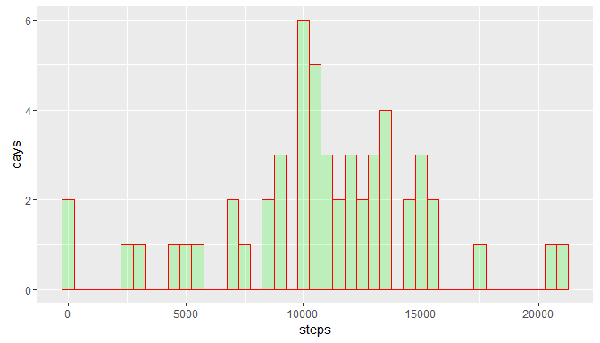
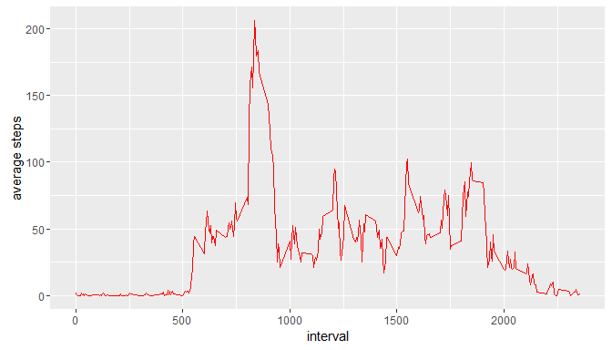
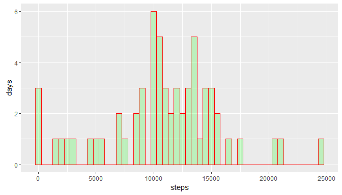
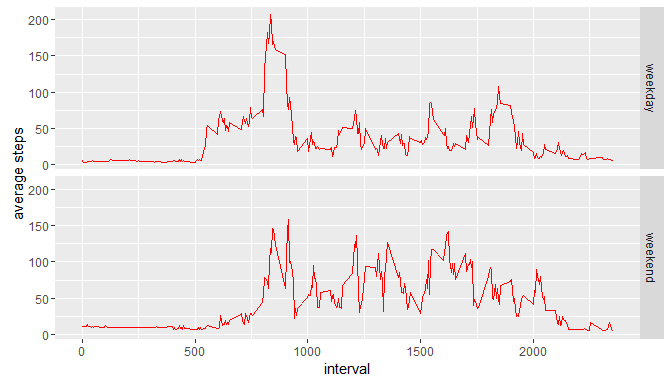

# Reproducible Research: Peer Assessment 1

## Loading and preprocessing the data

* Load libraries required for data analysis


```r
library(downloader)
library(ggplot2)
library(dplyr)
library(lubridate)
```

* Create variables to identify the data zip file


```r
ActivityMonitorZip <- "activity.zip"
ActivityMonitorCsv <- "./data/activity.csv"
```

* Check if 'data' directory exists
* Create 'data' if it does not


```r
if (!file.exists("./data")) {
      dir.create("./data")
}
```

* Check if 'ActivityMonitorCsv' file exists
* Extract 'ActivityMonitorZip' if it does not
* Place files in 'data' directory
* Record date extracted
* Read in 'ActivityMonitorCsv' file as 'AMD' data.frame


```r
if (!file.exists(ActivityMonitorCsv)){
      unzip(ActivityMonitorZip, exdir = "./data")
      dateExtracted <- date()
}

AMD <- read.csv(ActivityMonitorCsv, header = TRUE, sep = ",")
```

* Investigate the structure of the dataset


```r
str(AMD)
```

```
## 'data.frame':	17568 obs. of  3 variables:
##  $ steps   : int  NA NA NA NA NA NA NA NA NA NA ...
##  $ date    : Factor w/ 61 levels "2012-10-01","2012-10-02",..: 1 1 1 1 1 1 1 1 1 1 ...
##  $ interval: int  0 5 10 15 20 25 30 35 40 45 ...
```

* View a summary of the dataset - note the count of rows with NA values for the 'steps' variable


```r
summary(AMD)
```

```
##      steps                date          interval     
##  Min.   :  0.00   2012-10-01:  288   Min.   :   0.0  
##  1st Qu.:  0.00   2012-10-02:  288   1st Qu.: 588.8  
##  Median :  0.00   2012-10-03:  288   Median :1177.5  
##  Mean   : 37.38   2012-10-04:  288   Mean   :1177.5  
##  3rd Qu.: 12.00   2012-10-05:  288   3rd Qu.:1766.2  
##  Max.   :806.00   2012-10-06:  288   Max.   :2355.0  
##  NA's   :2304     (Other)   :15840
```

## What is mean total number of steps taken per day?

* Calculate total 'steps' taken per day (and save it to a variable)


```r
AMDstepssum <- aggregate(steps ~ date, AMD, sum)
head(AMDstepssum, 3)
```

```
##         date steps
## 1 2012-10-02   126
## 2 2012-10-03 11352
## 3 2012-10-04 12116
```

* Plot histogram of total 'steps' taken per day (and save it to a variable)


```r
plot_histogram1 <- ggplot(data = AMDstepssum, aes(steps)) +
                        geom_histogram(binwidth = 500,
                              col = "red", 
                              fill = "green", 
                              alpha = .2) + 
                        labs(x = "steps", y = "days")

plot_histogram1
```

<!-- -->

* Calculate mean value of total 'steps' taken per day (and save it to a variable)


```r
AMDstepssummean <- mean(AMDstepssum$steps)
AMDstepssummean
```

```
## [1] 10766.19
```

* Calculate median value of total 'steps' taken per day (and save it to a variable)


```r
AMDstepssummedian <- median(AMDstepssum$steps) 
AMDstepssummedian
```

```
## [1] 10765
```


## What is the average daily activity pattern?

* Calculate mean of 'steps' by 'interval' (and save it to a variable)


```r
AMDintervalmean <- aggregate(steps ~ interval, AMD, mean)
head(AMDintervalmean, 10)
```

```
##    interval     steps
## 1         0 1.7169811
## 2         5 0.3396226
## 3        10 0.1320755
## 4        15 0.1509434
## 5        20 0.0754717
## 6        25 2.0943396
## 7        30 0.5283019
## 8        35 0.8679245
## 9        40 0.0000000
## 10       45 1.4716981
```

* Plot mean of 'steps' taken by 'interval' (and save it to a variable)


```r
plot_timeseries1 <- ggplot(AMDintervalmean, aes(interval, steps)) +
                        geom_line(col = "red") +
                        xlab("interval") + 
                        ylab("average steps") 
plot_timeseries1
```

<!-- -->

## Imputing missing values

* Merge 'AMD' and 'AMDintervalmean' data.frames into a new data.frame 'AMDmerged'
* Appropriately rename resulting step count columns 
* Reorder 'AMDmerged' columns to match 'AMD'


```r
AMDmerged <- merge(x = AMD, y = AMDintervalmean, by = "interval", all.x = TRUE)  

AMDmerged <- rename(AMDmerged, steps = steps.x, steps.int.mean = steps.y) 

AMDmerged <- AMDmerged[ , c(2, 3, 1, 4)] 
summary(AMDmerged)
```

```
##      steps                date          interval      steps.int.mean   
##  Min.   :  0.00   2012-10-01:  288   Min.   :   0.0   Min.   :  0.000  
##  1st Qu.:  0.00   2012-10-02:  288   1st Qu.: 588.8   1st Qu.:  2.486  
##  Median :  0.00   2012-10-03:  288   Median :1177.5   Median : 34.113  
##  Mean   : 37.38   2012-10-04:  288   Mean   :1177.5   Mean   : 37.383  
##  3rd Qu.: 12.00   2012-10-05:  288   3rd Qu.:1766.2   3rd Qu.: 52.835  
##  Max.   :806.00   2012-10-06:  288   Max.   :2355.0   Max.   :206.170  
##  NA's   :2304     (Other)   :15840
```

* Create copy of original 'AMD' data.frame as 'AMDimputed'
* Impute NA values for the 'steps' variable with the mean of 'steps' at specific 'interval'


```r
AMDimputed <- AMD
AMDimputed$steps[is.na(AMDimputed$steps)] <- AMDmerged$steps.int.mean[is.na(AMDmerged$steps)]
```

* Investigate the structure of the imputed dataset


```r
str(AMDimputed)
```

```
## 'data.frame':	17568 obs. of  3 variables:
##  $ steps   : num  1.72 1.72 1.72 1.72 1.72 ...
##  $ date    : Factor w/ 61 levels "2012-10-01","2012-10-02",..: 1 1 1 1 1 1 1 1 1 1 ...
##  $ interval: int  0 5 10 15 20 25 30 35 40 45 ...
```

* View a summary of the imputed dataset - note the count of rows with NA values for the 'steps' variable


```r
summary(AMDimputed)
```

```
##      steps                date          interval     
##  Min.   :  0.00   2012-10-01:  288   Min.   :   0.0  
##  1st Qu.:  0.00   2012-10-02:  288   1st Qu.: 588.8  
##  Median :  0.00   2012-10-03:  288   Median :1177.5  
##  Mean   : 37.38   2012-10-04:  288   Mean   :1177.5  
##  3rd Qu.: 27.00   2012-10-05:  288   3rd Qu.:1766.2  
##  Max.   :806.00   2012-10-06:  288   Max.   :2355.0  
##                   (Other)   :15840
```

* Calculate total 'steps' taken per day (and save it to a variable)


```r
AMDimputedstepssum <- aggregate(steps ~ date, AMDimputed, sum)
head(AMDimputedstepssum, 3)
```

```
##         date      steps
## 1 2012-10-01   137.6604
## 2 2012-10-02   126.0000
## 3 2012-10-03 11352.0000
```

* Plot histogram of total 'steps' taken per day (and save it to a variable)


```r
plot_histogram2 <- ggplot(data = AMDimputedstepssum, aes(steps)) +
                        geom_histogram(binwidth = 500,
                              col = "red", 
                              fill = "green", 
                              alpha = .2) + 
                        labs(x = "steps", y = "days")

plot_histogram2
```

<!-- -->

* Calculate mean value of total 'steps' taken per day (and save it to a variable)


```r
AMDimputedstepssummean <- mean(AMDimputedstepssum$steps)
AMDimputedstepssummean
```

```
## [1] 10766.19
```

* Calculate median value of total 'steps' taken per day (and save it to a variable)


```r
AMDimputedstepssummedian <- median(AMDimputedstepssum$steps) 
AMDimputedstepssummedian
```

```
## [1] 11015
```

* Compare total, mean, and median values to the original non-imputed dataset


```r
sum(AMDimputedstepssum$steps)
```

```
## [1] 656737.5
```

```r
sum(AMDstepssum$steps)
```

```
## [1] 570608
```

```r
sum(AMDimputedstepssum$steps) - sum(AMDstepssum$steps)
```

```
## [1] 86129.51
```

```r
AMDimputedstepssummean - AMDstepssummean
```

```
## [1] 0
```

```r
AMDimputedstepssummedian - AMDstepssummedian
```

```
## [1] 250
```

## Are there differences in activity patterns between weekdays and weekends?

* Format the 'date' variable
* Add column 'day.name' (the day of the week)


```r
 AMDimputed$date <- as.Date(AMDimputed$date, format = "%Y-%m-%d")
 AMDimputed$day.name <- as.factor(weekdays(AMDimputed$date))
 
 head(AMDimputed)
```

```
##      steps       date interval day.name
## 1 1.716981 2012-10-01        0   Monday
## 2 1.716981 2012-10-01        5   Monday
## 3 1.716981 2012-10-01       10   Monday
## 4 1.716981 2012-10-01       15   Monday
## 5 1.716981 2012-10-01       20   Monday
## 6 1.716981 2012-10-01       25   Monday
```

* Create data.frame 'Week' to provide lookup values for 'day.name' variable


```r
day.name <- c('Sunday', 'Monday', 'Tuesday', 'Wednesday', 'Thursday', 'Friday', 'Saturday')
day.type <- c('weekend', 'weekday', 'weekday', 'weekday', 'weekday', 'weekday', 'weekend')
Week <- data.frame(day.name, day.type)
```

* Merge 'AMDimputed' and 'Week' data.frames into a new data.frame 'AMDimputedday'
* Reorder 'AMDimputedday' columns to match 'AMD' and 'AMDimputed'


```r
AMDimputedday <- merge(x = AMDimputed, y = Week, by = "day.name", all.x = TRUE)
AMDimputedday <- AMDimputedday[ , c(2, 3, 4, 1, 5)] 

str(AMDimputedday)
```

```
## 'data.frame':	17568 obs. of  5 variables:
##  $ steps   : num  0 0 0 0 0 0 0 0 0 0 ...
##  $ date    : Date, format: "2012-10-05" "2012-11-16" ...
##  $ interval: int  2220 430 2235 435 2315 445 2255 2300 2305 2245 ...
##  $ day.name: Factor w/ 7 levels "Friday","Monday",..: 1 1 1 1 1 1 1 1 1 1 ...
##  $ day.type: Factor w/ 2 levels "weekday","weekend": 1 1 1 1 1 1 1 1 1 1 ...
```

* Calculate mean of 'steps' by 'interval' and 'day.type' (and save it to a variable)


```r
AMDintervalmeanday <- aggregate(steps ~ interval + day.type, AMDimputedday, mean)
head(AMDintervalmeanday, 10)
```

```
##    interval day.type    steps
## 1         0  weekday 5.437736
## 2         5  weekday 3.815514
## 3        10  weekday 3.571069
## 4        15  weekday 3.593291
## 5        20  weekday 3.504403
## 6        25  weekday 4.726625
## 7        30  weekday 4.037736
## 8        35  weekday 4.437736
## 9        40  weekday 4.723270
## 10       45  weekday 6.323270
```


* Plot mean of steps taken by 'interval' and 'day.type' (and save it to a variable)


```r
plot_timeseries1 <- ggplot(AMDintervalmeanday, aes(interval, steps)) +
                        geom_line(col = "red") +
                        facet_grid(day.type ~ .) +
                        xlab("interval") + 
                        ylab("average steps") 
plot_timeseries1
```

<!-- -->
